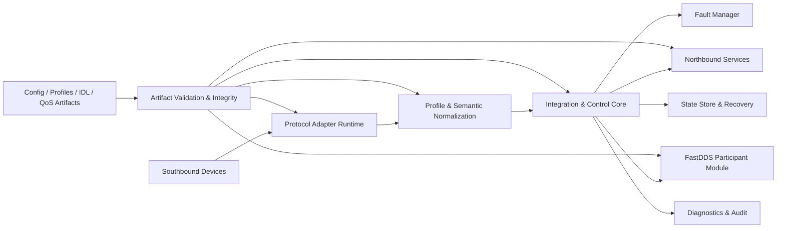
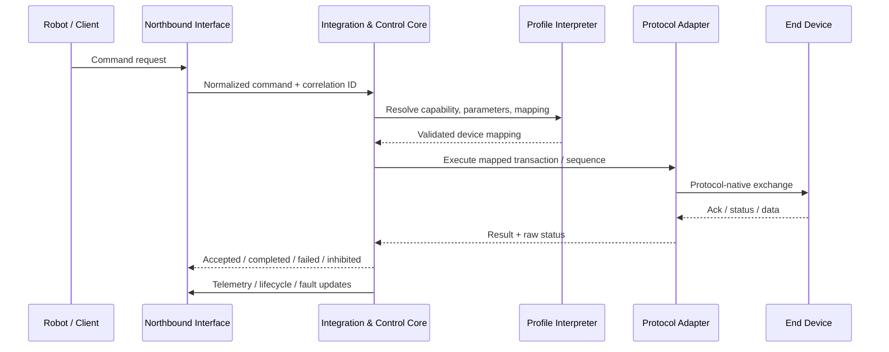
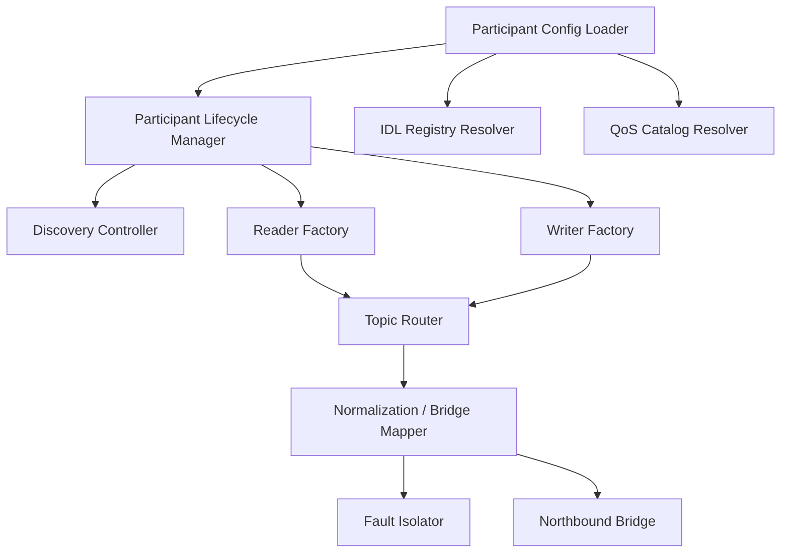

# Protocol & Service Module Specification  
**Draft v0.1 — derived from PRS v2.3, ICD v2.3, and DPS v1.1**

This draft converts the governing requirements in the QNC PRS, ICD, and DPS into an implementation-oriented specification for protocol adapters, service modules, and the FastDDS extension. It preserves the documented QNC boundaries: four-layer architecture, governed release scope, profile-driven southbound integration, controlled FastDDS participation, Safe Mode behavior, and artifact-based configuration/integrity control.   

---

## 1. Scope and Design Drivers

This specification applies to all QNC protocol and service modules that implement released southbound protocols, northbound interface realization, and—when explicitly released—the FastDDS peer integration path. Baseline southbound scope is IO-Link, Modbus RTU, EtherNet/IP adapter mode, and discrete digital I/O. Approved extension scope includes Modbus TCP, CANopen, and governed DDS/FastDDS participation; advanced gateway items such as EtherCAT, PROFINET, and Discovery Server-based large-scale DDS remain out of baseline and require separate validation before release.   

The implementation SHALL satisfy the documented operational constraints: discovery within 5 seconds per protocol, device communication fault detection within 2 seconds, Safe Mode transition within 1 second for defined critical faults, command latency below 50 ms at the 95th percentile from REST API to device, telemetry at or above 10 Hz per device, restart recovery below 30 seconds, support for 8 concurrent device connections, 10 concurrent northbound clients, and up to 20 DDS topic subscriptions per DomainParticipant when the FastDDS extension is enabled. 

---

## 2. Overall Architecture

The module architecture SHALL realize the PRS/ICD layered model while preserving the DPS boundary that device profiles remain declarative artifacts rather than executable logic.   

### 2.1 Core Runtime Modules

| Module | Primary Responsibility | Key Interfaces |
|---|---|---|
| Artifact Validation & Integrity Manager | Validate schema, signature, compatibility, and release-scope legality for system config, profiles, protocol configs, DDS IDL, and DDS QoS artifacts | Config Interface, Security Interface |
| Protocol Adapter Runtime | Host protocol-specific session engines behind a common adapter contract | Southbound Protocol Link |
| Profile Interpreter | Load YAML device profile sections and resolve command/telemetry/fault mappings | DPS-bound artifact APIs |
| Semantic Normalization Engine | Convert protocol-native semantics into QNC command, telemetry, state, and fault abstractions | Integration & Control |
| Command Orchestrator | Validate preconditions, execute command workflow, enforce Safe Mode and retry/timeout policy | `qnc.command`, `qnc.response` |
| Telemetry Scheduler & Event Publisher | Poll, subscribe, normalize, and publish telemetry and lifecycle events | `qnc.telemetry`, `qnc.lifecycle` |
| Fault Manager | Detect, classify, latch, publish, and recover faults without cross-layer contamination | `qnc.fault`, logs |
| FastDDS Participant Module | Governed DDS domain participation, topic I/O, schema/QoS enforcement, and bridge functions | DDS Peer Interface |
| Diagnostics & Service Manager | State inspection, protocol statistics, recent events, maintenance actions | `qnc.service` |
| Persistent State Store | Restore last known valid config, active profile set, and fault history | Recovery path |

The common runtime SHALL expose a stable internal adapter contract so that each southbound protocol module implements the same lifecycle: `discover()`, `bind_profile()`, `connect()`, `execute_command()`, `read_or_subscribe_telemetry()`, `recover()`, and `shutdown()`. That contract is necessary to satisfy the ICD’s interface consistency and the DPS requirement that profiles map into runtime-supported declarative behaviors only.  

### 2.2 Canonical Data Flow

Command outcomes SHALL match the ICD response model: accepted, rejected, completed successfully, completed with warning, failed, timed out, canceled, or inhibited by mode. 

---

## 3. Protocol Module Architecture

Each southbound protocol module SHALL contain five internal subcomponents aligned to the DPS logical layers: identity matcher, binding/session manager, capability executor, mapping engine, and governance/compatibility guard. Profiles SHALL declare exactly one released southbound binding, and the runtime SHALL refuse activation if the binding is outside the installed build’s released scope. 

### 3.1 Mandatory Adapter Behaviors

1. **Identity and binding**  
   Match device identity using explicit profile policy: exact match, bounded family, protocol signature, or operator-approved manual binding.

2. **Session control**  
   Establish protocol session, apply bounded defaults, maintain state, and reconnect per configured retry class.

3. **Command execution**  
   Interpret declarative `device_mapping` objects only; no arbitrary scripting or unbounded loops are permitted.

4. **Telemetry handling**  
   Support periodic or event-and-periodic publication policies with quality flags and category separation.

5. **Fault isolation**  
   Map native faults to QNC severity and latch rules without collapsing unrelated services.

### 3.2 Protocol Adapter Contract

| Contract Area | Requirement |
|---|---|
| Discovery | Complete within 5 s per protocol mode where discovery is supported |
| Profile legality | Reject unsupported protocol identifiers and incompatible versions |
| Timeouts | Use named timeout classes; deterministic behavior required |
| Retries | Bounded retry classes only |
| Atomicity | Commands SHALL declare single-transaction, multi-step atomic, or multi-step non-atomic |
| Safe Mode | Reject new actuation; allow only status/health traffic where permitted |
| Diagnostics | Expose counters, last error, last successful cycle, and session state |
| Audit | Log profile load, connect/disconnect, command failures, recovery actions |

These behaviors derive from the PRS functional requirements, ICD timing/QoS rules, and DPS declarative profile model.   

---

## 4. [FastDDS](https://www.genspark.ai/api/files/s/P1yWxfqS) Participant Module Design

The FastDDS Participant Module is an approved-extension module only. It SHALL be enabled only when the installed build, configuration artifacts, IDL registry entries, and QoS catalog versions are all validated and compatible. Subscribed and published topics SHALL be limited to approved topics with validated IDL schemas and approved QoS combinations; DDS faults SHALL be isolated from unrelated southbound protocol services. In Safe Mode, DDS participation MAY continue in subscribe-only mode when configuration explicitly permits it.  

### 4.1 Internal Structure

### 4.2 Responsibilities

| Submodule | Responsibility |
|---|---|
| Participant Config Loader | Load domain ID, discovery mode, allowed topics, role permissions |
| IDL Registry Resolver | Resolve approved type name, version, compatibility matrix |
| QoS Catalog Resolver | Resolve only approved QoS profiles for each topic |
| Participant Lifecycle Manager | Create, start, degrade, stop, and recover the DomainParticipant |
| Discovery Controller | Operate SIMPLE discovery as baseline; Discovery Server only in approved advanced mode |
| Reader/Writer Factories | Instantiate endpoints only for approved topic-direction pairs |
| Topic Router | Route data between DDS and internal normalized channels |
| Bridge Mapper | Perform validated DDS-to-internal and DDS-to-northbound mappings |
| Fault Isolator | Convert DDS faults to structured QNC DDS-domain faults without service bleed |

### 4.3 Participant Lifecycle

| State | Entry Condition | Exit Condition |
|---|---|---|
| `UNCONFIGURED` | Module disabled or artifacts absent | Artifacts validated |
| `CONFIGURED` | IDL/QoS/config integrity passed | Participant creation requested |
| `DISCOVERING` | Participant created, discovery active | Peers discovered or timeout |
| `ACTIVE` | Readers/writers attached, routes healthy | Fault, Safe Mode, or shutdown |
| `DEGRADED` | Partial topic/path failure | Recovery or stop |
| `SUBSCRIBE_ONLY` | Safe Mode or policy restriction | Safe Mode cleared |
| `STOPPED` | Disabled, shutdown, or unrecoverable incompatibility | Reconfigure |

### 4.4 Topic Organization

Because the source documents govern topic approval but not a final naming tree, this draft defines a controlled organization:

| Topic Class | Direction | Purpose | Example Convention |
|---|---|---|---|
| Command control | QNC publish / subscribe by approved role | Low-rate command or reply patterns | `qnc/dds/control/...` |
| State stream | Publish or subscribe | Device or robot state snapshots | `qnc/dds/state/...` |
| Telemetry stream | Publish or subscribe | Continuous measurements | `qnc/dds/telemetry/...` |
| Fault/event | Publish | Latched and non-latched event notifications | `qnc/dds/fault/...` |
| Bridge output | Publish | DDS-derived northbound normalized data | `qnc/dds/bridge/...` |

The naming tree SHALL remain subordinate to the approved IDL Type Registry and compatibility matrix; arbitrary topics are not supported.  

### 4.5 Communication Patterns and Data Types

| Pattern | DDS Shape | Typical Use |
|---|---|---|
| Request/reply | separate request and response topics | managed command exchanges |
| Pub/sub state | periodic or event-triggered topic | robot or device state |
| Fault event | reliable event topic | warnings, errors, critical alarms |
| Bridge publish | normalized outbound topic | DDS-to-OPC UA / DDS-to-MQTT source feed |

Approved IDL schemas SHALL define the actual payload types; this specification defines only the module behavior and governance boundary.  

---

## 5. QoS Profile Catalog

The governing documents require a controlled QoS catalog but do not prescribe concrete profile names. The following catalog is a proposed implementation baseline consistent with the required policies for reliability, durability, latency, liveliness, and history. QoS mismatches SHALL be logged as structured DDS faults.  

| QoS Profile ID | Reliability | Durability | Latency Budget | Liveliness | History | Intended Use |
|---|---|---|---|---|---|---|
| `QOS_CMD_REQ_V1` | Reliable | Volatile | 10 ms | Automatic, lease 1 s | KeepLast(1) | command request topics |
| `QOS_CMD_RSP_V1` | Reliable | Volatile | 10 ms | Automatic, lease 1 s | KeepLast(5) | command response / completion |
| `QOS_STATE_FAST_V1` | BestEffort | Volatile | 5 ms | Automatic, lease 2 s | KeepLast(5) | high-rate non-critical state |
| `QOS_STATE_STRICT_V1` | Reliable | Volatile | 20 ms | Automatic, lease 2 s | KeepLast(10) | lower-rate but guaranteed state |
| `QOS_FAULT_EVENT_V1` | Reliable | TransientLocal | 20 ms | Automatic, lease 5 s | KeepLast(50) | fault and lifecycle events |
| `QOS_CONFIG_AUDIT_V1` | Reliable | TransientLocal | 100 ms | Automatic, lease 10 s | KeepLast(100) | config/audit dissemination |
| `QOS_BRIDGE_NB_V1` | Reliable | Volatile | 20 ms | Automatic, lease 2 s | KeepLast(10) | DDS-to-northbound bridge paths |
| `QOS_DISCOVERY_MIN_V1` | implementation default per validated FastDDS baseline | Volatile | N/A | Automatic | KeepLast(1) | baseline participant bring-up |

### 5.1 QoS Use Rules

- Commands and fault events SHALL use reliable delivery.  
- Only replay-worthy events, configuration notices, or retained alarms SHALL use transient local durability.  
- High-rate observational telemetry MAY use best effort only when loss is acceptable and the mapping is explicitly approved.  
- A topic SHALL bind to exactly one approved QoS profile version.  
- QoS catalog version SHALL be tracked independently from firmware, interface schema, profile schema, and IDL versions. 

---

## 6. Deployment Mode Configuration

QNC supports multiple deployment shapes, but each mode must remain within the PRS release-scope model and the ICD artifact-governance rules.  

| Mode | Scope | Enabled Modules | Key Parameters | Design Notes |
|---|---|---|---|---|
| **Standalone Southbound Gateway** | Baseline | Southbound adapters, REST, WebSocket, logging | active protocols, device count, retry classes, telemetry intervals | default production baseline |
| **Distributed Edge Node** | Baseline / Extension | Standalone + OPC UA/MQTT when released | northbound endpoints, client limits, bridge routes | for plant integration |
| **DDS Edge Peer** | Extension | Distributed edge + FastDDS participant | domain ID, discovery mode, allowed topics, IDL set, QoS catalog version | SIMPLE discovery baseline |
| **Federated Edge / Cloud Relay** | Extension / Advanced | DDS peer + approved aggregation / MQTT / future discovery-server topology | relay policies, bandwidth caps, topic filters, store-and-forward | only validated paths released |

### 6.1 Baseline Configuration Parameters

| Parameter | Applies To | Meaning |
|---|---|---|
| `protocol_enable_set` | all | released protocol modules enabled in build |
| `profile_repository` | all | approved profile bundle source |
| `max_devices` | all | default 8 concurrent devices |
| `telemetry_rate_class` | all | profile-aligned minimum 10 Hz/device |
| `safe_mode_policy` | all | reject actuation, allow status/health only |
| `fault_history_limit` | all | minimum persistent 1000 fault events |
| `northbound_client_limit` | northbound modes | default 10 clients |
| `dds_enabled` | DDS modes | enables participant module |
| `dds_discovery_mode` | DDS modes | `SIMPLE` or approved advanced mode |
| `dds_topic_limit` | DDS modes | default 20 subscribed topics |
| `recovery_target_s` | all | < 30 s restart recovery |

---

## 7. Protocol-Specific Customization

The common architecture SHALL be specialized per protocol without breaking the shared adapter contract. Profiles remain the source of device-specific mapping; protocol modules supply the transport/session semantics. 

| Protocol | Release Tier | Customization Focus | Special Constraints |
|---|---|---|---|
| IO-Link | Baseline | port/device identity, cyclic process data, acyclic parameter services | master semantics only; profile binding explicit |
| Modbus RTU | Baseline | serial timing, register/coil mapping, polling and retry classes | bounded serial defaults required |
| EtherNet/IP Adapter | Baseline | Class 1 / Class 3 handling, session state, object mapping | released adapter-mode scope only |
| Discrete Digital I/O | Baseline | signal direction, debounce, edge detection, safe-state mapping | source/sink config explicit |
| Modbus TCP | Extension | Ethernet session handling, register map reuse, reconnection policy | released only when enabled in build |
| CANopen | Extension | node identity, object dictionary mapping, PDO/SDO handling | released only when validated |
| FastDDS | Extension | participant lifecycle, topic governance, QoS enforcement, bridge mapping | approved topics and QoS only |

### 7.1 Cross-Protocol Normalization Rules

- Command names SHALL map to normalized capabilities, not protocol-native names.  
- Vendor-specific telemetry MAY be exposed but SHALL remain explicitly labeled as vendor-specific.  
- Fault severity SHALL be normalized as Warning, Error, or Critical; critical faults SHALL support latching and Safe Mode triggers where specified by profile or module policy.  
- Non-atomic commands SHALL define intermediate-failure and compensation behavior.  

---

## 8. Security, Integrity, and Governance

All configuration artifacts relevant to protocol and service modules—system configuration, device profiles, protocol configurations, DDS IDL schemas, DDS QoS profiles, update packages, and diagnostic bundles—SHALL undergo schema validation, integrity verification, version compatibility checks, and atomic application. Production profiles SHALL be signed; integrity failure SHALL cause rejection of activation, logging of a security event, and fault emission while the system retains or reverts to the last known valid state.  

Northbound security SHALL support TLS 1.2 or higher, authenticated access, role-based authorization for configuration/service actions, secure update verification, DDS domain access policy configuration where DDS is enabled, and audit logging of configuration changes, state changes, authorization failures, recovery actions, and Safe Mode transitions. 

---

## 9. Verification and Acceptance Criteria

| Area | Acceptance Target |
|---|---|
| Southbound discovery | ≤ 5 s per supported discovery mode |
| Command path latency | < 50 ms p95, < 100 ms p99 |
| Telemetry | ≥ 10 Hz per active device profile class |
| DDS bridge latency | < 20 ms p95 on approved paths |
| Fault detection | communication faults within 2 s |
| Safe Mode | inhibit transition within 1 s |
| Recovery | restart to operational state within 30 s |
| Capacity | 8 devices, 10 northbound clients, 20 DDS subscriptions |
| Persistence | config retained; ≥ 1000 fault events retained |
| Auditability | all config/state/security actions logged |

These acceptance thresholds are direct design drivers from the PRS and ICD and should be traced to test cases in the future Verification & Validation Plan.  

---

## 10. Implementation Notes for Engineering Teams

This draft deliberately separates **what the profile declares** from **what the module executes**. Device profiles define bounded identity, command, parameter, telemetry, lifecycle, compatibility, and fault mappings; protocol/service modules implement session logic, timing, error handling, and publication mechanics. DDS artifacts remain separate governed configuration types and must never be embedded as substitutes for southbound device profiles. 

If you want, I can next turn this into either a **formal controlled specification document** with document control sections and approval tables, or a **developer-ready version** with interface definitions, YAML examples, and per-module API contracts.
