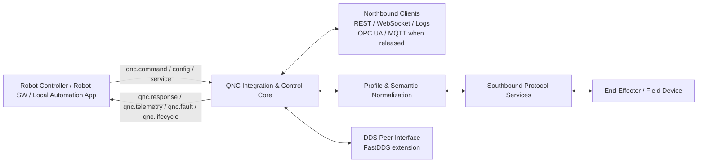
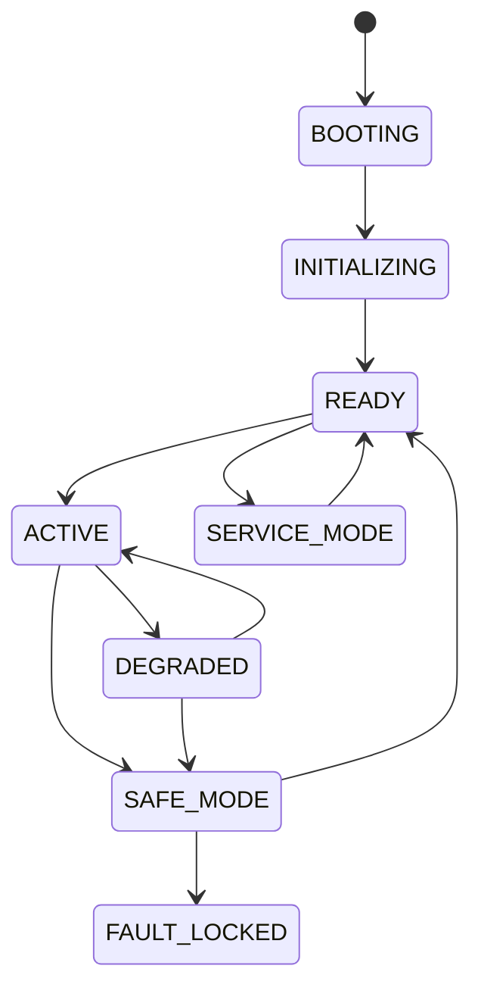
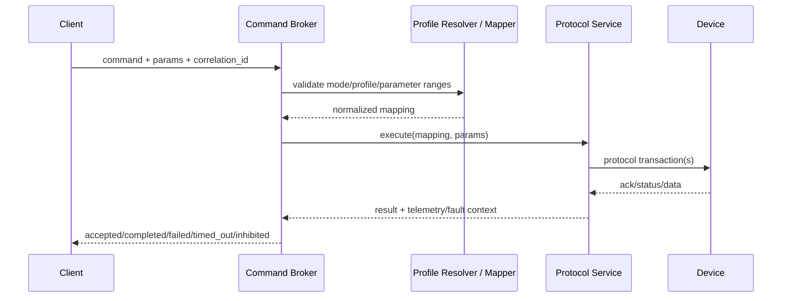
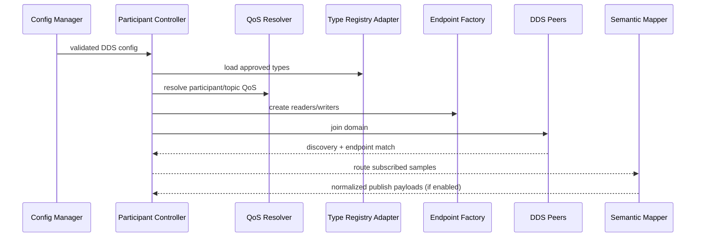
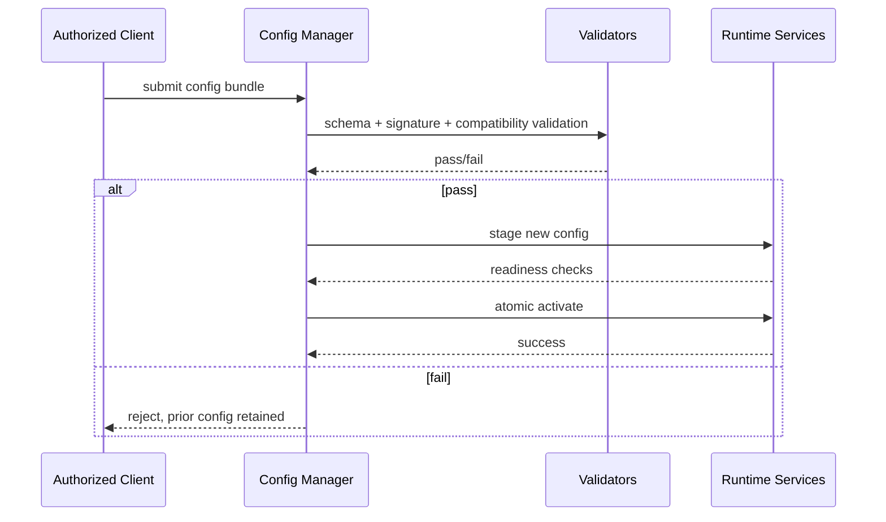

# QNC Protocol & Service Module Specification

**Document Number:** QNC-PSM-001  
**Version:** Draft 0.1  
**Status:** Draft companion specification derived from QNC PRS v2.3, ICD v2.3, and DPS v1.1  
**Classification:** Internal / Project Controlled

---

## 1. Purpose and Scope

This specification defines the implementation architecture, runtime responsibilities, configuration structure, QoS catalog, deployment modes, and protocol-specific adaptation rules for the QNC protocol and service modules. It is intended to govern how QNC realizes southbound industrial protocol services, northbound edge services, and the FastDDS participation module in approved deployment scopes.  

This specification is subordinate to the PRS for product scope and architecture boundaries, to the ICD for interface contracts and state/fault semantics, and complementary to the DPS, which governs device profile artifacts only. DDS topic schemas, QoS profiles, and participant behavior are defined here and in the future IDL registry rather than inside device profiles.  

---

## 2. Normative Position

The module architecture defined herein shall preserve the QNC product principle of **unified integration, not native universality**. No module shall imply support for unreleased protocols, unsupported device classes, or uncontrolled DDS interoperability. Baseline release modules are limited to IO-Link, Modbus RTU, EtherNet/IP Adapter, discrete digital I/O, REST, WebSocket, and structured logging. FastDDS, Modbus TCP, CANopen, OPC UA, and MQTT are extension features and shall only be enabled in released builds and validated configurations.  

---

## 3. Overall Architecture

### 3.1 Layered Model

QNC protocol and service modules shall be organized into four implementation layers:

1. **Physical & Protocol Adaptation Layer**  
   Owns device transport drivers, protocol session management, transport framing/parsing, signal conditioning, and FastDDS transport/domain attachment where released.

2. **Profile & Semantic Normalization Layer**  
   Loads validated device profiles, resolves protocol bindings, executes declarative mappings, validates command parameters, normalizes telemetry, and maps faults into QNC fault codes.

3. **Integration & Control Layer**  
   Hosts command orchestration, lifecycle control, response correlation, routing between protocol modules and internal services, state aggregation, Safe Mode gating, and internal event distribution.

4. **Northbound Edge Services Layer**  
   Exposes REST, WebSocket, structured logging, and when released, OPC UA, MQTT, and approved DDS-to-northbound bridges.  

### 3.2 Primary Runtime Modules

| Module | Layer | Primary Responsibility |
|---|---|---|
| Transport Adapter | Physical & Protocol Adaptation | Physical link control, framing, retries, timeouts |
| Protocol Service | Physical & Protocol Adaptation | Protocol state machine and transaction execution |
| DDS Participant Service | Physical & Protocol Adaptation | FastDDS participant lifecycle, endpoint creation, discovery |
| Profile Resolver | Profile & Semantic Normalization | Select active profile and validate compatibility |
| Semantic Mapper | Profile & Semantic Normalization | Command/telemetry/fault normalization |
| Lifecycle Manager | Integration & Control | BOOTING→ACTIVE transitions, inhibit gates, recovery |
| Command Broker | Integration & Control | Command validation, dispatch, correlation, completion |
| State Aggregator | Integration & Control | Separate lifecycle, connection, protocol, profile, class, vendor states |
| Fault Manager | Integration & Control | Fault classification, latching, publication, Safe Mode entry |
| Northbound API Service | Northbound Edge Services | REST/WebSocket/logging, versioned schemas |
| Extension Bridge Service | Northbound Edge Services | DDS-to-OPC UA, DDS-to-MQTT, aggregation where released |
| Config & Artifact Manager | Cross-cutting | Schema validation, signatures, atomic apply, rollback |
| Diagnostics Service | Cross-cutting | Audit logs, traceability, metrics, service tooling |

This decomposition is consistent with the source requirement that QNC separate protocol handling, semantic normalization, lifecycle/control, and northbound service exposure while preserving fault isolation boundaries.  

### 3.3 System Context Diagram



The logical interfaces shall remain semantically equivalent to `qnc.command`, `qnc.response`, `qnc.telemetry`, `qnc.fault`, `qnc.lifecycle`, and `qnc.service`, even when realized through different middleware bindings. 

### 3.4 Data Flow Model

**Command flow:** northbound request → command validation → profile/state precondition check → protocol-specific translation → transport execution → completion evaluation → response/fault publication.  
**Telemetry flow:** protocol polling/subscription or DDS subscription → normalization → state aggregation → event/periodic publication.  
**Fault flow:** source-layer detection → category/severity assignment → latch/isolate decision → Safe Mode evaluation → publication and audit logging.   

---

## 4. Interface Model

### 4.1 External Interface Classes

The following interface classes are normative for the module design:

| Interface Class | Direction | Implemented By |
|---|---|---|
| Integration Command Interface | Client → QNC | REST / internal broker / approved DDS bridge |
| Integration Telemetry Interface | QNC → Client | WebSocket / REST status / OPC UA / MQTT |
| Integration Fault Interface | QNC → Client | WebSocket / logging / OPC UA events / MQTT |
| Southbound Protocol Link Interface | QNC ↔ Device | Protocol service + transport adapter |
| Northbound Client Interface | QNC ↔ Consumers | API service / extension bridge |
| DDS Peer Interface | QNC ↔ DDS domain | DDS Participant Service |
| Configuration Interface | Tooling / authorized client → QNC | Config & Artifact Manager |
| Service Interface | Tooling ↔ QNC | Diagnostics / update / recovery |

These classes are directly aligned to the ICD interface taxonomy. 

### 4.2 Required Logical Channels

| Logical Channel | Purpose | Default Realization |
|---|---|---|
| `qnc.command` | Command issuance | REST POST / internal bus |
| `qnc.response` | Deterministic command result | REST response / async event |
| `qnc.telemetry` | Periodic/event telemetry | WebSocket / REST status |
| `qnc.fault` | Warnings/errors | WebSocket / logs |
| `qnc.lifecycle` | Mode transitions | WebSocket / status endpoint |
| `qnc.service` | Diagnostics, management | REST service API |

The module implementation may vary endpoint names per binding, but shall preserve these semantics and versioning rules. 

---

## 5. State, Lifecycle, and Fault Isolation

### 5.1 State Separation

Runtime state shall be maintained as six distinct but correlated domains:

| State Domain | Owner | Meaning |
|---|---|---|
| Lifecycle State | Lifecycle Manager | BOOTING, INITIALIZING, READY, ACTIVE, DEGRADED, SAFE_MODE, SERVICE_MODE, FAULT_LOCKED |
| Connection State | Transport Adapter | Physical/logical link up/down/degraded |
| Protocol State | Protocol Service / DDS Participant Service | Session readiness, discovery, subscription health |
| Profile State | Profile Resolver | Active profile validity and compatibility |
| Device-Class State | Semantic Mapper | Normalized class-specific state |
| Vendor-Specific State | Semantic Mapper | Raw device/vendor state |

This separation is mandatory so that faults or uncertainty in one domain do not corrupt unrelated abstractions. 

### 5.2 Lifecycle Sequence



QNC shall enter Safe Mode on defined critical faults, reject new actuation commands in Safe Mode, and may continue status/health communications and DDS subscribe-only participation if the validated configuration permits it. DDS domain faults shall be isolated from unrelated southbound operations unless a shared critical resource failure is explicitly documented.  

### 5.3 Fault Categories

| Fault Category | Example Source | Isolation Rule |
|---|---|---|
| Configuration Fault | Invalid schema/signature | Block apply, keep prior valid config |
| Profile Fault | Unsupported profile / semantic rule error | Disable affected profile only |
| Connection Fault | Cable/link loss | Isolate to affected adapter/device |
| Protocol Fault | Timeout, parse error, session failure | Isolate to protocol instance |
| Command Validation Fault | Bad parameter / mode violation | Reject command only |
| Device-Reported Fault | Vendor alarm | Map to normalized fault |
| Service/Update Fault | Update rollback triggered | Isolate service plane |
| Integrity/Security Fault | Signature mismatch, auth failure | Block access/apply |
| DDS Domain Fault | QoS mismatch, discovery loss, IDL incompatibility | Must not degrade unrelated southbound services |

The Fault Manager shall include severity, timestamp, source layer, current mode, summary, and recommended recovery action in each published fault record. 

---

## 6. Southbound Protocol Service Architecture

### 6.1 Common Southbound Service Pattern

Each southbound protocol service shall implement the same internal contract:

- `init(adapter_config, protocol_config, profile_binding)`
- `discover()`
- `connect(target)`
- `execute(command_mapping, parameters)`
- `read_telemetry(mapping_set)`
- `read_faults(mapping_set)`
- `recover(policy)`
- `shutdown()`

This allows the Profile & Semantic Normalization Layer to remain protocol-agnostic while using declarative profile mappings. The DPS explicitly requires exactly one released southbound protocol binding per profile, including binding metadata, session requirements, communication defaults, and addressing rules. 

### 6.2 Baseline Southbound Protocols

| Protocol Identifier | Release Tier | Core Service Responsibilities |
|---|---|---|
| `IO_LINK` | Baseline | Port/session setup, parameter access, cyclic/acylcic reads, device identification |
| `MODBUS_RTU` | Baseline | Serial transport, unit addressing, coil/register transaction handling |
| `ETHERNET_IP_ADAPTER` | Baseline | CIP object/class/instance access, Class 1 and Class 3 session behavior |
| `DISCRETE_DIGITAL_IO` | Baseline | Input/output scan, debounce, polarity, sourcing/sinking config |

Baseline support is restricted to these protocols unless a newer build formally releases extensions.   

### 6.3 Approved Southbound Extensions

| Protocol Identifier | Release Tier | Notes |
|---|---|---|
| `MODBUS_TCP` | Approved Extension | Ethernet-based Modbus |
| `CANOPEN` | Approved Extension | CiA 301/302 support as released |
| `SERIAL_CAN_APPROVED` | Approved Extension | Placeholder for formally approved variants |

Advanced gateway protocols such as EtherCAT and PROFINET shall not appear in runtime activation, profile bindings, or deployment claims until separately released.  

### 6.4 Southbound Command Execution Sequence



Command outcomes shall conform to the ICD completion model: accepted, rejected, completed successfully, completed with warning, failed, timed out, canceled, or inhibited by mode. 

---

## 7. FastDDS Participant Module Design

### 7.1 Scope and Position

The FastDDS Participant Module is an **approved extension** service that allows QNC to join a DDS domain in validated configurations, subscribe to approved topics, publish approved topics where explicitly enabled, and bridge DDS-derived data into QNC internal abstractions and released northbound services. It shall not be treated as baseline capability unless released in the target build.  

### 7.2 Internal Structure

| Submodule | Responsibility |
|---|---|
| Participant Controller | Create/destroy DomainParticipant and own lifecycle state |
| Discovery Manager | Configure SIMPLE or Discovery Server mode, peer lists, lease timers |
| Type Registry Adapter | Resolve approved IDL type definitions and compatibility |
| Topic Registry | Track approved topics, directions, schemas, versions |
| Endpoint Factory | Create publishers, subscribers, readers, writers |
| QoS Resolver | Load approved QoS profile by topic/use case |
| Sample Router | Route DDS samples into normalization or bridge services |
| DDS Fault Monitor | Detect discovery loss, QoS mismatch, schema mismatch, publication failures |
| Safe Mode Policy Gate | Enforce publish/subscribe restrictions during SAFE_MODE |
| Metrics & Audit Adapter | Emit participant join/leave/fault/perf events |

These responsibilities are directly implied by PRS requirements for participant creation, approved topic subscription/publication, QoS governance, schema validation, fault isolation, and logging of join/leave/fault events. 

### 7.3 Lifecycle Management

#### 7.3.1 Participant States

| Participant State | Meaning |
|---|---|
| `DDS_DISABLED` | FastDDS extension not released or not configured |
| `DDS_CONFIGURED` | Config artifacts validated, not yet attached |
| `DDS_JOINING` | Participant creation and discovery startup in progress |
| `DDS_ACTIVE` | Participant discovered peers and active endpoints |
| `DDS_DEGRADED` | Partial endpoint or discovery impairment |
| `DDS_SUBSCRIBE_ONLY` | Safe Mode or policy-limited mode |
| `DDS_FAULTED` | Fault condition requiring intervention |
| `DDS_STOPPED` | Participant intentionally shut down |

#### 7.3.2 Lifecycle Rules

1. DDS artifacts shall be validated before participant creation.  
2. Domain ID, discovery mode, and participant QoS shall come from governed config artifacts.  
3. Endpoint creation shall occur only for approved topics with validated IDL and QoS compatibility.  
4. On configuration failure, QNC shall remain in a prior valid state and block activation.  
5. On critical DDS faults, the module shall enter `DDS_FAULTED` while preserving unrelated southbound services.  
6. In Safe Mode, the module may remain active in subscribe-only mode if explicitly allowed by policy.  

### 7.4 Discovery Configuration

#### 7.4.1 Supported Discovery Modes

| Mode | Tier | Intended Use |
|---|---|---|
| `SIMPLE` | Baseline DDS deployment mode | Same-LAN or small approved robot domains |
| `DISCOVERY_SERVER` | Advanced tier | Large-scale or cross-network deployments after additional validation |

SIMPLE discovery shall be the default mode for released DDS deployments. Discovery Server mode is permitted only in approved advanced configurations. 

#### 7.4.2 Discovery Parameters

| Parameter | SIMPLE | DISCOVERY_SERVER |
|---|---|---|
| `domain_id` | Required | Required |
| `participant_name` | Required | Required |
| `lease_duration_ms` | Required | Required |
| `announcement_period_ms` | Required | Required |
| `metatraffic_unicast_locators` | Optional | Optional |
| `metatraffic_multicast_enabled` | Default true | Usually false |
| `server_list` | N/A | Required |
| `max_initial_peers` | Optional | Optional |
| `ignore_nonapproved_peers` | Recommended | Required |
| `allowed_interface_list` | Recommended | Recommended |

### 7.5 Topic Organization

DDS topics shall be organized by function and governance class, not by ad hoc integration needs.

| Topic Class | Direction | Example Purpose |
|---|---|---|
| Command-Ingress | DDS → QNC | Robot-originated requests |
| Status-Egress | QNC → DDS | QNC lifecycle/status publication |
| Telemetry-Ingress | DDS → QNC | Robot-domain sensor or status data |
| Telemetry-Egress | QNC → DDS | Normalized device data publication |
| Fault-Egress | QNC → DDS | Structured fault events |
| Bridge-Staging | Internal | Approved DDS-to-northbound transformation path |

All topics shall be listed in the governed IDL Type Registry with direction, schema version, QoS profile, and bridge eligibility. DDS topics and QoS definitions are explicitly outside the DPS and belong in this module specification and companion DDS artifacts.  

### 7.6 Publisher/Subscriber Design

#### 7.6.1 Reader/Writer Rules

| Rule | Requirement |
|---|---|
| Topic approval | Required prior to endpoint creation |
| Type match | Exact IDL compatibility or approved compatible evolution |
| QoS match | Must resolve via governed profile catalog |
| Direction control | Read/write permissions defined per topic |
| Backpressure handling | Required for slow consumer scenarios |
| Fault publication | Required on negotiation, schema, or discovery failure |
| Correlation | Required for command-related request/response patterns |

#### 7.6.2 Data Type Classes

| Data Type Class | Ownership |
|---|---|
| QNC Core Types | Common lifecycle/status/fault/health structures |
| Device-Class Types | Gripper, actuator, sensor normalized payloads |
| Bridge Types | Sanitized subsets for northbound bridging |
| Vendor-Specific Extension Types | Explicitly labeled and bounded |
| Service Types | Diagnostics/configuration notifications |

#### 7.6.3 Communication Patterns

| Pattern | Use |
|---|---|
| Pub/Sub telemetry | Continuous device or robot state |
| Request/Response over correlated topics | Command acknowledgment/completion |
| Event-only publication | Faults, lifecycle transitions |
| Subscribe-only policy | Safe Mode DDS participation |
| Bridge fan-out | Validated DDS-to-OPC UA / DDS-to-MQTT release paths |

### 7.7 FastDDS Sequence Diagram



### 7.8 Safe Mode Behavior for DDS

| Condition | DDS Read | DDS Write | Notes |
|---|---|---|---|
| Normal ACTIVE | Allowed | Allowed where enabled | Full approved behavior |
| DEGRADED | Allowed | Limited by fault policy | No unsafe bridge escalation |
| SAFE_MODE | Allowed if configured | Block all actuation-related writes | Subscribe-only mode permitted |
| FAULT_LOCKED | Minimal health only | Blocked | Manual recovery required |

This directly reflects the PRS rule that Safe Mode may permit DDS subscribe-only participation and must reject new actuation commands. 

---

## 8. QoS Profile Catalog

### 8.1 Governance

The PRS and ICD require that subscribed and published DDS topics be limited to approved topics with validated IDL schemas and QoS policies from governed catalogs, and that QoS mismatch faults be detected and logged. The following catalog is therefore defined as the initial normative draft for implementation.  

### 8.2 QoS Profile Definitions

| Profile ID | Reliability | Durability | History | Depth | Latency Budget | Liveliness | Lease Duration | Typical Use |
|---|---|---|---|---:|---|---|---|---|
| `QOS_CMD_STRICT` | RELIABLE | VOLATILE | KEEP_LAST | 10 | 5 ms | MANUAL_BY_TOPIC | 500 ms | Command request/response |
| `QOS_STATUS_FAST` | RELIABLE | VOLATILE | KEEP_LAST | 5 | 10 ms | AUTOMATIC | 1000 ms | Lifecycle/status |
| `QOS_TELEM_STREAM` | BEST_EFFORT | VOLATILE | KEEP_LAST | 20 | 20 ms | AUTOMATIC | 2000 ms | High-rate telemetry |
| `QOS_TELEM_CRITICAL` | RELIABLE | VOLATILE | KEEP_LAST | 20 | 20 ms | AUTOMATIC | 1000 ms | Safety-adjacent health data, non-safety-rated |
| `QOS_FAULT_EVENT` | RELIABLE | TRANSIENT_LOCAL | KEEP_LAST | 50 | 10 ms | AUTOMATIC | 5000 ms | Fault/warning events |
| `QOS_CONFIG_AUDIT` | RELIABLE | TRANSIENT_LOCAL | KEEP_ALL | n/a | 100 ms | AUTOMATIC | 10000 ms | Config/audit changes |
| `QOS_BRIDGE_OPCUA` | RELIABLE | VOLATILE | KEEP_LAST | 10 | 20 ms | AUTOMATIC | 2000 ms | DDS-to-OPC UA bridge feed |
| `QOS_BRIDGE_MQTT` | RELIABLE | VOLATILE | KEEP_LAST | 50 | 50 ms | AUTOMATIC | 5000 ms | DDS-to-MQTT bridge feed |
| `QOS_DIAG_BULK` | BEST_EFFORT | VOLATILE | KEEP_LAST | 100 | 100 ms | AUTOMATIC | 10000 ms | Diagnostics/traces |
| `QOS_DISCOVERY_ADV` | RELIABLE | VOLATILE | KEEP_LAST | 20 | 50 ms | AUTOMATIC | 5000 ms | Advanced Discovery Server deployments |

### 8.3 Profile Usage Mapping

| Topic / Channel Class | Default QoS Profile |
|---|---|
| Command ingress | `QOS_CMD_STRICT` |
| Command completion/response | `QOS_CMD_STRICT` |
| Lifecycle/status | `QOS_STATUS_FAST` |
| Standard telemetry | `QOS_TELEM_STREAM` |
| Critical health/availability telemetry | `QOS_TELEM_CRITICAL` |
| Fault and warning events | `QOS_FAULT_EVENT` |
| Audit/configuration notifications | `QOS_CONFIG_AUDIT` |
| DDS-to-OPC UA staging | `QOS_BRIDGE_OPCUA` |
| DDS-to-MQTT staging | `QOS_BRIDGE_MQTT` |
| Diagnostics | `QOS_DIAG_BULK` |

### 8.4 Policy Notes

- **Reliability** shall be RELIABLE for commands, fault events, configuration changes, and bridge staging where loss is unacceptable.  
- **Durability** shall be TRANSIENT_LOCAL for events that late joiners must observe, especially fault and audit channels.  
- **History** shall default to KEEP_LAST unless replay semantics are explicitly required and validated.  
- **Latency budget** shall be selected to support NFR goals such as <50 ms command path and <20 ms DDS-to-northbound bridging.  
- **Liveliness** shall be used to detect silent endpoint failure and support structured faulting. 

### 8.5 QoS Mismatch Handling

Any offered/requested QoS incompatibility shall produce:

1. Structured DDS domain fault  
2. Topic name and endpoint identity in fault context  
3. Requested and offered QoS summary  
4. No impact to unrelated southbound services  
5. Transition of affected DDS topic instance to degraded/faulted state only  

---

## 9. Deployment Mode Configuration

### 9.1 Supported Modes

| Deployment Mode | Description | Release Position |
|---|---|---|
| Standalone Device Gateway | Single QNC, baseline southbound + baseline northbound | Baseline |
| Distributed Edge Node | Multiple protocol services and optional extension bridges | Approved Extension where applicable |
| Edge + DDS Peer | QNC joins robot DDS domain and bridges approved data | Approved Extension |
| Cloud-Connected Edge | QNC publishes northbound data to higher systems via released services | Extension / rollout-dependent |
| Advanced DDS Multi-Network | Discovery Server or large-scale cross-network DDS | Advanced tier only |

The PRS defines baseline, approved extension, and advanced gateway direction tiers; deployment mode availability shall follow those boundaries. 

### 9.2 Mode Configuration Table

| Parameter | Standalone | Distributed Edge | Edge + DDS Peer | Cloud-Connected Edge | Advanced DDS Multi-Network |
|---|---|---|---|---|---|
| `enabled_southbound_protocols` | Baseline only | Baseline + released extensions | Baseline + released extensions | Baseline + released extensions | Released DDS + approved network policy |
| `enabled_northbound_services` | REST/WebSocket/logs | + OPC UA/MQTT when released | REST/WebSocket/logs + DDS | + cloud-facing service bindings | DDS + bridge services |
| `dds_enabled` | false | optional | true | optional | true |
| `dds_discovery_mode` | n/a | SIMPLE if enabled | SIMPLE | SIMPLE | DISCOVERY_SERVER |
| `multi_device_aggregation` | minimal | optional | optional | recommended | required |
| `fault_isolation_scope` | per device | per service instance | per service + DDS topic set | per service instance | per domain segment |
| `resource_limits_profile` | small | medium | medium/high | medium/high | high |
| `store_and_forward` | optional logs | optional | optional | recommended | recommended |

### 9.3 Scalability Considerations

| Concern | Requirement |
|---|---|
| Device fan-in | Isolate per protocol instance; do not centralize all state machines in one lock domain |
| Topic fan-out | Use per-topic QoS and backpressure policies |
| Aggregation | Normalize once, publish many |
| Config growth | Validate artifacts independently and atomically |
| Failure containment | Contain per device, protocol instance, or DDS topic set |

### 9.4 Fault Tolerance Considerations

- Configuration apply shall be atomic with rollback to prior valid state.  
- Restart recovery shall restore valid configuration and persistent state.  
- DDS faults shall not cascade into southbound failures.  
- Southbound device faults shall not tear down unrelated northbound services. 

### 9.5 Performance Targets

| Metric | Target |
|---|---|
| REST command to device latency | < 50 ms, 95th percentile |
| Telemetry update rate | 10 Hz per device baseline target |
| DDS-to-northbound bridge latency | < 20 ms |
| Status query northbound response | < 10 ms |
| Safe Mode transition on critical fault | < 1 s |
| DDS peer discovery in SIMPLE mode | within 5 s |

These values come directly from PRS functional/non-functional expectations and should be used as validation targets for this specification. 

---

## 10. Protocol-Specific Customization

### 10.1 General Rule

Each protocol service shall inherit the common service contract but adapt transport assumptions, addressing, session management, command mapping primitives, telemetry extraction style, and fault models according to its protocol family. The DPS requires these protocol-specific fields to be documented here rather than hidden inside device profiles. 

### 10.2 IO-Link Module

| Aspect | Customization |
|---|---|
| Addressing | Port-centric addressing |
| Session Model | Master-port-device relationship |
| Optimization | Cached parameter metadata, cyclic process data handling |
| Constraints | Device identity and profile match must be explicit |
| Telemetry Style | Periodic process data + acyclic parameter reads |
| Fault Focus | Port loss, parameter access failure, device mismatch |

### 10.3 Modbus RTU Module

| Aspect | Customization |
|---|---|
| Addressing | Unit ID + register/coil addressing |
| Session Model | Serial line arbitration and timeout classes |
| Optimization | Register block coalescing, retry classes |
| Constraints | Serial settings explicit in communication defaults |
| Telemetry Style | Poll-driven |
| Fault Focus | CRC/timeouts, framing errors, stale responses |

### 10.4 EtherNet/IP Adapter Module

| Aspect | Customization |
|---|---|
| Addressing | CIP object/class/instance/attribute |
| Session Model | Class 1 / Class 3 connection rules |
| Optimization | Connection reuse, assembly mapping caches |
| Constraints | Explicit profile-declared CIP binding fields |
| Telemetry Style | Connection-driven or cyclic |
| Fault Focus | Session loss, connection timeout, attribute mismatch |

### 10.5 Discrete Digital I/O Module

| Aspect | Customization |
|---|---|
| Addressing | Line/channel mapping |
| Session Model | Stateless scan loop with debounce/filter policy |
| Optimization | Edge-triggered event suppression and debounce windows |
| Constraints | Polarity, sourcing/sinking, inhibit mapping |
| Telemetry Style | Event + periodic confirmation |
| Fault Focus | Open/short if supported, contradictory line state |

### 10.6 Modbus TCP Module

| Aspect | Customization |
|---|---|
| Addressing | IP endpoint + unit/register map |
| Session Model | Persistent TCP session with reconnect |
| Optimization | Pipelined read grouping where allowed |
| Constraints | Extension only until released |
| Telemetry Style | Poll-driven or request-triggered |
| Fault Focus | Connection drop, stale socket, response mismatch |

### 10.7 CANopen Module

| Aspect | Customization |
|---|---|
| Addressing | Node ID + index/subindex |
| Session Model | NMT state awareness, SDO/PDO handling |
| Optimization | PDO subscription for telemetry, SDO for config |
| Constraints | Released object dictionaries only |
| Telemetry Style | PDO event/cyclic |
| Fault Focus | Node guarding, heartbeat failure, dictionary mismatch |

### 10.8 FastDDS Module

| Aspect | Customization |
|---|---|
| Addressing | Domain ID + topic/type names + endpoint identity |
| Session Model | Participant discovery and endpoint matching |
| Optimization | Topic-level QoS tuning and bridge staging |
| Constraints | Approved topics only; validated IDL/QoS artifacts mandatory |
| Telemetry Style | Event-driven / pub-sub |
| Fault Focus | Discovery loss, QoS mismatch, schema incompatibility |

---

## 11. Configuration Artifacts

### 11.1 Artifact Classes

| Artifact | Owner | Validation |
|---|---|---|
| System Configuration | Config Manager | Schema + integrity + compatibility |
| Device Profile | DPS-governed | Schema + semantic + release compatibility |
| Protocol Module Config | This spec | Schema + runtime capability match |
| DDS IDL Type Registry | DDS governance | Schema/version compatibility |
| DDS QoS Profile Catalog | This spec / DDS governance | Schema + policy validity |
| Security Credentials / Trust Material | Security subsystem | Integrity + authorization rules |
| Update Package | Service/update subsystem | Signature + compatibility |

The ICD explicitly identifies system config, device profiles, DDS IDL schemas, DDS QoS profiles, protocol settings, update packages, and diagnostic bundles as governed artifact classes. 

### 11.2 Example Deployment Configuration Skeleton

```yaml
runtime:
  release_scope: baseline|extension|advanced
  lifecycle_policy:
    safe_mode_auto_enter: true
    safe_mode_recovery: manual

southbound:
  protocol_instances:
    - id: gripper_rtu_1
      protocol: MODBUS_RTU
      enabled: true
      transport_profile: serial_rtu_default
      addressing_mode: unit_id
      communication_defaults:
        baud_rate: 115200
        parity: even
        timeout_ms: 100
      profile_ref: profile.gripper.vendorA.v1

dds:
  enabled: true
  discovery_mode: SIMPLE
  domain_id: 42
  participant_name: qnc-edge-01
  topic_set_ref: topic_catalog.v1
  qos_catalog_ref: qos_catalog.v1
  allow_publish_in_safe_mode: false
  allow_subscribe_in_safe_mode: true

northbound:
  rest:
    enabled: true
  websocket:
    enabled: true
  opcua:
    enabled: false
  mqtt:
    enabled: false
```

### 11.3 Configuration Apply Sequence



All configuration updates shall be validated before application, applied atomically, and rolled back on failure. 

---

## 12. Security, Integrity, and Governance

All protocol and service modules shall enforce TLS 1.2+ where HTTPS/WebSocket security is enabled, token-based authentication and RBAC for configuration/service access, integrity checks for all controlled artifacts, and audit logging for profile loads and configuration changes. Signature verification shall be mandatory for firmware and controlled update artifacts.  

Device profiles shall not embed arbitrary application logic or uncontrolled scripts. They may contain declarative mappings, bounded sequences, constrained metadata, and enumerated rules only. DDS types and QoS definitions shall be governed independently and referenced by approved identifiers. 

---

## 13. Validation and Verification Requirements

### 13.1 Required Test Categories

| Test Category | Applies To |
|---|---|
| Protocol conformance | All southbound protocol services |
| Profile semantic validation | Profile Resolver / Mapper |
| DDS join/leave/discovery tests | FastDDS module |
| QoS negotiation tests | FastDDS module |
| IDL compatibility tests | FastDDS module / Type Registry |
| Fault injection | All protocol and service modules |
| Safe Mode transition tests | Lifecycle / Fault Manager |
| Recovery and rollback tests | Config Manager / Service layer |
| Performance benchmark | Command, telemetry, bridge paths |
| Isolation tests | DDS vs southbound, service vs protocol, per-device containment |

### 13.2 Mandatory Acceptance Behaviors

- Invalid config shall be rejected without corrupting prior valid runtime state.  
- Unsupported protocol/profile combinations shall refuse activation.  
- QoS mismatch shall be logged as structured DDS domain fault.  
- Critical faults shall trigger Safe Mode within 1 second.  
- REST-to-device command latency shall satisfy the PRS target at the validated percentile.  
- DDS SIMPLE discovery shall confirm peer visibility within the approved interval. 

---

## 14. Explicit Boundary with Device Profiles

The DPS remains the governing source for device profile structure, including identity, binding, capabilities, commands, parameters, telemetry, faults, lifecycle sequences, compatibility, validation, and security metadata. This specification shall define how runtime protocol services interpret those fields, but shall not move DDS topic schemas or QoS catalogs into the profile artifact. A device profile declares exactly one southbound protocol binding and references released runtime capabilities; DDS artifacts remain separately governed. 

---

## 15. Implementation Summary

This draft establishes a concrete engineering baseline:

- a four-layer module architecture aligned with PRS/ICD,  
- a reusable per-protocol service contract,  
- a governed FastDDS Participant module with lifecycle, discovery, and fault isolation rules,  
- a first-pass QoS catalog mapped to QNC use cases,  
- deployment mode configurations spanning standalone through advanced DDS deployments, and  
- protocol-specific customization rules that preserve profile-driven normalization.   

---

## Source Documents

- [QNC Product Requirements & System Definition Specification (PRS) v2.3](https://www.genspark.ai/api/files/s/P1yWxfqS)  
- [QNC Interface Control Document (ICD) v2.3](https://www.genspark.ai/api/files/s/07u19c9p)  
- [QNC Device Profile Specification (DPS) v1.1](https://www.genspark.ai/api/files/s/579jFqNh)
