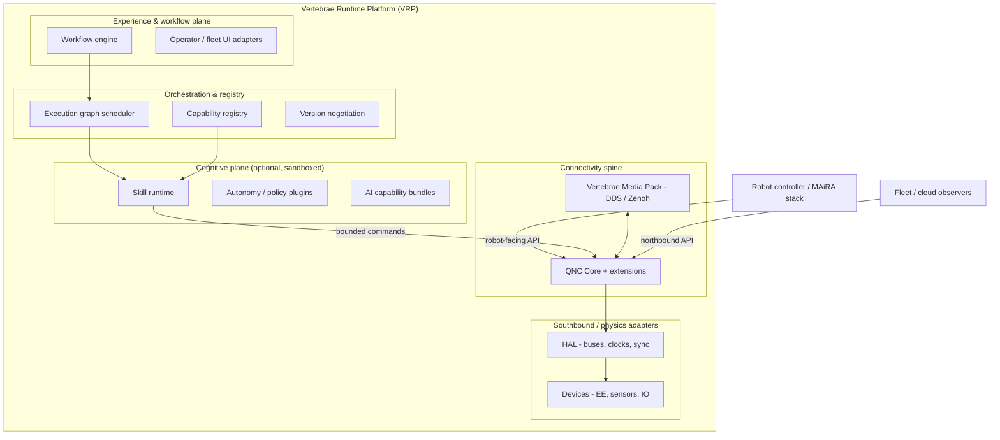
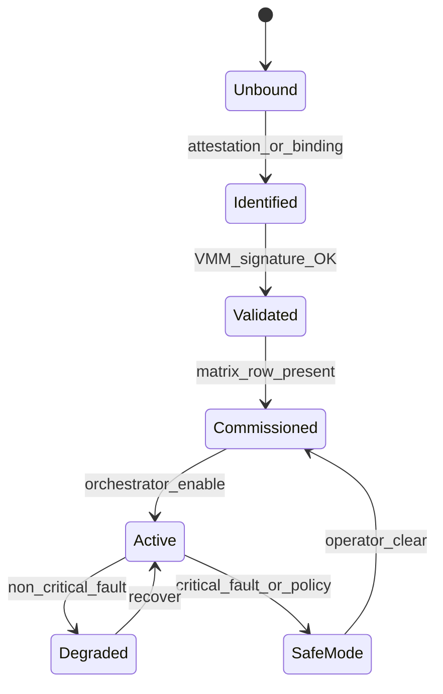
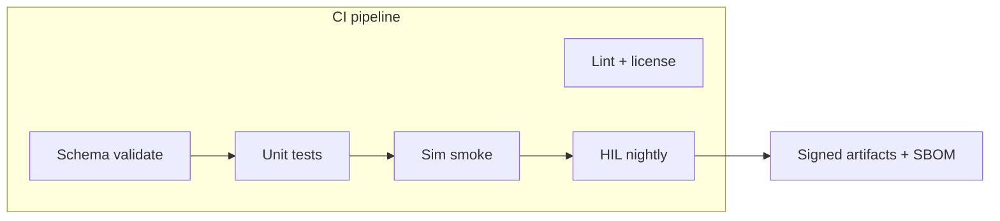
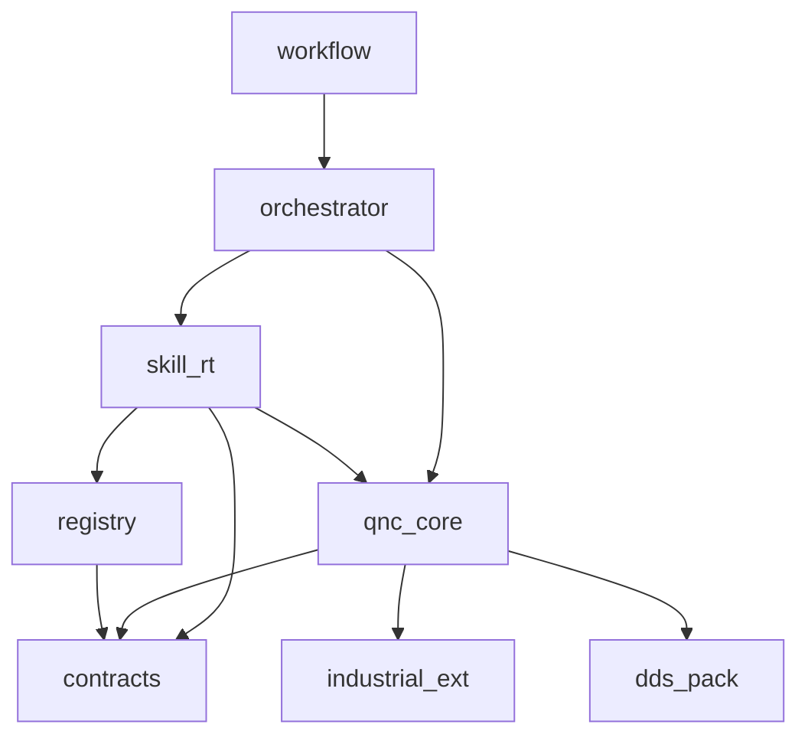

---
---
# Vertebrae × QNC — Platform Architecture & Evolution (v1)

**Document:** VRT-ARCH-001  
**Status:** Architecture directive — extends QNC-PRD-001 v3.0 family  
**Audience:** Platform architects, TPgM, integrators, ecosystem partners  
**Classification:** Internal / Project Controlled  

---

## Executive framing

**QNC v1** (per `PRS_v3.0.md`) is intentionally a **narrow, defensible industrial edge gateway**: southbound field protocols, YAML device profiles, canonical semantics (`QNC-SEMANTIC-CORE-v1`), dual REST/WebSocket APIs, Safe Mode, atomic config.

**Vertebrae** is a **broader physical–digital ecosystem thesis**: modular end-effectors, sensors, skills, autonomy packages, and workflows from **multiple vendors**, with **capability discovery**, **sandboxed execution**, and **lifecycle governance**.

This document **does not** collapse that distinction. It defines how **QNC becomes the mandatory southbound and connectivity spine** inside a larger **Vertebrae Runtime Platform (VRP)**, while preserving QNC’s explicit **non-goals** (not a motion controller, not safety-rated, not ROS replacement).

---

## Part 1 — Analysis of the existing QNC “project”

### 1.1 Repository / artifact reality

| Expectation | Actual (workspace) |
|-------------|-------------------|
| Code monorepo | **None present** — normative **markdown specifications** + archive |
| Runtime implementation | **Out of band** — must be bootstrapped per this architecture |
| API artifacts | **Referenced** (`qnc-robot-api-vMAJOR.yaml`, `qnc-northbound-api-vMAJOR.yaml`) — not checked in here |

**Implication:** “Refactor” applies first to **specification layering and product boundaries**, then to **implementation repo** once code exists.

### 1.2 Strengths (reusable for Vertebrae)

| Asset | Reuse |
|-------|--------|
| **QNC-SEMANTIC-CORE-v1** | Becomes **Tier-1 wire semantics** for device/skill commands, responses, telemetry, faults — extend, do not fork |
| **DPS v2.0** YAML profiles | Direct model for **Vertebrae Module Manifest (VMM)** — same governance patterns (signing, semver, compatibility) |
| **Three-tier model** (Core / Industrial Ext / DDS Pack) | Template for **Vertebrae Core / Vertebrae Media Pack / Partner Packs** with **fault_domain** isolation |
| **Dual API** (robot-facing vs northbound) | Maps cleanly to **cell integrator API** vs **fleet/observability API** |
| **Atomic config + rollback** | Required for **hot-swap** and **A/B skill bundles** |
| **PSM protocol matrices** | Pattern for **no universal discovery** — replace with **attestation + binding + capability registry** |
| **PRD explicit non-goals** | **Retain** — Vertebrae must not silently re-scope QNC into motion control or functional safety |

### 1.3 Architectural bottlenecks vs Vertebrae vision

| QNC v1 constraint | Vertebrae tension |
|-------------------|-------------------|
| **Southbound-centric** — profiles map **devices**, not **skills** or **AI graphs** | Need **execution plane** above QNC |
| **No universal plugin runtime** (PRD §5.3) | Ecosystem **requires** a **governed** plugin/skill runtime — **outside** QNC Core scope but **adjacent** in VRP |
| **Capacity targets** (8 devices, bounded WS) | Multi-vendor **sensor + EE** density may require **horizontal scale** (satellite QNC instances) |
| **Command categories** limited (`profile`, `transport`, `management`) | Need **`skill`**, **`workflow`**, **`autonomy`** categories in **VRP semantic extension**, mapped to QNC where applicable |
| **DDS Pack optional** | Distributed robots may **require** DDS or Zenoh — position as **Vertebrae Media Pack**, not “optional afterthought” for AMR use cases |
| **Single QNC lifecycle** | Vertebrae needs **per-module lifecycle** + **cell-level orchestration** state machine |

### 1.4 Missing abstractions (gaps)

1. **Hardware identity & attestation** beyond protocol binding (vendor/model/serial, cryptographic identity where available).  
2. **Capability registry** — discoverable **skills**, **resources**, **interfaces**, not only device telemetry.  
3. **Execution graph** — DAG/state-machine for multi-step workflows with **budgets** (time, energy, workspace).  
4. **Version negotiation** across **robot API**, **VMM**, **skill bundle**, and **QNC core** simultaneously.  
5. **Sandbox / isolation model** for third-party code (process, cgroup, seccomp, optional micro-VM).  
6. **Simulation-first** contract (same manifests drive sim + hardware).  

### 1.5 Technical debt (spec-level)

| Issue | Remediation |
|-------|-------------|
| **Naming:** “Quick Network Connector” undersells platform role | **Product:** retain QNC as subsystem brand; **platform:** market **Vertebrae Runtime** |
| **Dual OpenAPI sync** (EDP R-02) | Single **contract-first** schema (Protobuf/JSON Schema) → codegen OpenAPI + DDS IDL slices |
| **`discovery_hints` → `binding_hints`** (DPS §8.1) | Complete rename in schema + examples |

### 1.6 Conflicts to resolve explicitly

- **Do not** position Vertebrae as “QNC + app store” without **safety and liability** articulation — PRD safety position **must remain** on all QNC-branded deliverables.  
- **Hot-swappable modules** in **physics** are not the same as **hot-reload profiles** — document **mechanical vs logical** swap semantics separately.

---

## Part 2 — Target platform architecture (VRP)

### 2.1 Layer model



**Rule:** QNC remains the **only** component that speaks Modbus/IO-Link/EIP/DIO to devices in v1 alignment; skills **never** open raw southbound sockets directly.

### 2.2 Core platform layers (normative names)

| Layer | Name | Responsibility |
|-------|------|----------------|
| L0 | **Physics & HAL** | Mechanical coupling awareness, timestamps, PTP if present — **not** QNC today; **robot BSP or co-processor** |
| L1 | **QNC Core** | As PRS v3.0 — profiles, semantic normalization, APIs, Safe Mode |
| L2 | **Vertebrae Registry** | Module identity, capability manifests, compatibility, attestation results |
| L3 | **Vertebrae Orchestrator** | Execution graphs, resource locking, conflict detection |
| L4 | **Skill runtime** | Sandboxed processes, quotas, QNC command adapter |
| L5 | **Workflow / autonomy** | Multi-skill compositions, human-in-the-loop |

### 2.3 Vertebrae Interface (conceptual stack)

Formal detail: **`VERTEBRAE-INTERFACE-STANDARD-v0.1.md`**.  
Summary: **VMM** (YAML/JSON) + **VRT** (runtime token) + **VSA** (sandbox contract).

### 2.4 Plugin architecture

| Plugin class | Host | Isolation |
|--------------|------|-----------|
| **Southbound adapter** | QNC Industrial Extension | process + fault_domain |
| **DDS / Zenoh bridge** | Media Pack | existing DDS isolation |
| **Skill** | VRP Skill Runtime | cgroup + seccomp + no network default |
| **Autonomy policy** | VRP | read-only world model APIs + action budget |

### 2.5 Capability registry

Backed by: **OCI-style digest** of VMM + **semantic core version** + **robot API schema**.  
APIs: CRUD for integrators; **read-only catalog** for robot; **signed publish** for vendors.

### 2.6 Skill runtime → QNC path

Skills emit **canonical Commands** (extended schema) → **Command Broker** (existing PSM concept) → southbound.  
**Precondition:** Skill declares `requires_devices: [...]` and `max_command_rate_hz`; orchestrator enforces.

### 2.7 Execution graph model

- **Nodes:** skill step, QNC command batch, wait-for-telemetry, human gate.  
- **Edges:** conditions on `completion` + telemetry predicates.  
- **Global:** deadline, Safe Mode escalation on `fault_domain`.

### 2.8 Device / module lifecycle



### 2.9 Interoperability standards

| Axis | Choice |
|------|--------|
| Wire semantics | **Extend** QNC semantic core (new command categories in **VRP extension document**, not duplicated in ICD) |
| Robotics middleware | **Optional bridges** — ROS 2 topics/services **via Media Pack** only where tested |
| Fleet | **gRPC or REST** for registry — v1 can be internal-only |

### 2.10 Safety boundaries

- **Invariant:** Same as PRD — QNC Safe Mode is **operational inhibit**, not functional safety.  
- **Vertebrae adds:** **skill sandbox resource limits**, **workspace clips** (declared in VMM), **human confirmation nodes** for irreversible actions.  
- **Certification narrative:** “Platform enables **integration of certified subsystems**” — each tier has its own evidence package.

### 2.11 Distributed robotic components

- **Pattern:** One **VRP coordinator** per cell; **multiple QNC instances** (e.g., wrist-attached vs base) as **federated peers** with shared registry.  
- **Clock:** coordinated `timestamp_utc` + monotonic `sequence` per device stream.

### 2.12 Simulation-first

- **VMM** includes `simulation:` block: inertia, contact proxy, noise model IDs.  
- **CI:** profile + manifest validation + **digital twin smoke** (containerized) before `Released`.

---

## Part 3 — Production repository structure (proposal)

### 3.1 Strategy: **monorepo with strict dependency tiers**

**Rationale:** Single semver for platform releases; shared codegen from one schema repo; CI enforces DAG (`qnc-core` must not import `skill-runtime`).

```
vertebrae-platform/                 # root monorepo
  docs/
    specs/                          # normative MD + PDF exports
      qnc/                          # migrated QNC-* specs
      vertebrae/
        VERTEBRAE-INTERFACE-STANDARD.md
    adr/                            # architecture decision records
    governance/
  contracts/                        # single source of truth
    jsonschema/
    protobuf/                       # optional: internal RPC
    openapi/                        # generated qnc-robot-api, qnc-northbound-api
  packages/
    qnc-core/                       # southbound, broker, config (current QNC scope)
    qnc-industrial-ext/
    qnc-dds-pack/
    vrp-registry/                   # capability registry service
    vrp-orchestrator/
    vrp-skill-runtime/
    vrp-workflow/
    hal-adapters/                   # robot-specific; thin
  sdk/
    python/neura-vertebrae-sdk/
    cpp/vertebrae-cpp/
  sim/
    assets/
    scenarios/
  test/
    contract/
    integration/
    soak/
  deployment/
    helm/
    systemd/
    yocto/                          # optional embedded
  ci/
    github-actions/ or gitlab-ci/
    policies/                       # OPA, license allowlist
  tools/
    vmm-cli/
    profile-linter/
```

### 3.2 Multirepo alternative

Split only when: **separate release cadence** for `qnc-core` vs `vrp-*` becomes operationally painful **and** contract semver is automated. Until then, **monorepo** reduces drift (addresses EDP R-02, R-05).

### 3.3 Module ownership

| Package | Owner |
|---------|-------|
| `qnc-core` | Connectivity / fieldbus team |
| `vrp-*` | Platform / runtime team |
| `contracts/*` | Architecture board + codegen bot |
| `sdk/*` | DevEx |

### 3.4 Versioning

- **Platform release:** `VRP x.y.z` bundles pinned `qnc-core a.b.c`.  
- **Semantic core:** MAJOR bumps are **CCB-gated** (per PRS §16).  
- **VMM:** semver independent; **compatibility matrix** row = (`VRP`, `QNC`, `robot_api`, `vmm`).

### 3.5 Testing strategy

| Layer | Tests |
|-------|-------|
| Contracts | schemathesis / openapi diff in CI |
| QNC | protocol simulators, fault injection |
| VRP | sandbox escape attempts, resource exhaustion |
| E2E | hardware-in-loop matrix rows only |

### 3.6 CI/CD topology



### 3.7 Deployment topology

- **Edge:** VRP + QNC on cell gateway (Class B appliance per PRD §8).  
- **Satellite:** optional second QNC on mobile base — same registry, **distinct** `qnc_instance_id`.

---

## Part 4 — Documentation suite (create / migrate)

| Document | Action |
|----------|--------|
| `PRS_v3.0.md` | Add **§2.5 Vertebrae positioning** — QNC as subsystem; link VRT-ARCH-001 |
| `QNC-SEMANTIC-CORE-v1.md` | Add **Annex VRP** — new command categories (normative process: RFC) |
| New `VERTEBRAE-PLATFORM-VISION.md` | Vision, philosophy, ecosystem incentives |
| New `VERTEBRAE-DEVELOPER-GUIDE.md` | Onboarding, VMM authoring, SDK |
| New `VERTEBRAE-ECOSYSTEM-GOVERNANCE.md` | Tiers, certification, liability split |
| `QNC-ORG_v1.1.md` | Add **multi-QNC** and **VRP recovery** runbooks |

---

## Part 5 — Module dependency map



**Forbidden edge:** `qnc_core --> skill_rt` (no upward dependency).

---

## Part 6 — Migration strategy (current QNC architecture → VRP)

### Phase 0 — Spec alignment (4–6 weeks)

1. Freeze **QNC v1 baseline** as **L1-only** product for shipping gateway.  
2. Approve **VRP extension RFC** for semantic core command categories.  
3. Publish **VMM schema v0.1** alongside DPS (shared validation tooling).

### Phase 1 — Parallel implementation (8–12 weeks)

1. Implement **registry** + read APIs (northbound).  
2. **Skill runtime** stub: one signed “noop skill” → QNC management command.  
3. **Execution graph** MVP: linear scripts only.

### Phase 2 — Ecosystem beta (ongoing)

1. Partner **Tier B** manifests (unsigned dev / signed prod per EDP R-04).  
2. ROS 2 **shim** topic pack in Media Pack **only** with explicit matrix rows.

### Phase 3 — Scale

1. Federated QNC + registry replication.  
2. Workflow marketplace **legal + technical** gates.

### Compatibility guarantees

- **Existing YAML DPS profiles** remain valid without modification for **QNC-only** deployments.  
- **VMM** **references** `profile_id` — optional binding until skill needs device.

---

## Part 7 — Prioritized implementation roadmap

| Priority | Deliverable | Rationale |
|----------|-------------|-----------|
| P0 | **Contract-first** codegen pipeline | Eliminates dual-OpenAPI drift |
| P0 | **VMM schema + linter** | Unblocks vendor mental model |
| P0 | **Registry MVP** | Central discovery |
| P1 | **Skill runtime sandbox** | Ecosystem trust |
| P1 | **Execution graph MVP** | Workflow differentiation |
| P2 | **Second QNC federation** | Scale / AMR |
| P2 | **Simulation CI** | Velocity |
| P3 | **Public partner program** | GTM |

---

## Part 8 — MVP recommendation

**MVP:** **VRP Lite** — QNC Core unchanged + **Registry** + **linear execution** + **one** certified third-party skill path + **sandbox defaults**.  
**Non-MVP (explicit defer):** full marketplace payments, fleet aggregation, universal ROS parity.

---

## Part 9 — Long-term evolution

- **Semantic federation:** optional **industry profile registries** (e.g., gripper ontology) mapped into canonical IDs.  
- **Hardware attestation:** TPM on module → registry **trust score**.  
- **Policy bundles:** insurer-friendly **packaged risk configs**.

---

## Part 10 — Ecosystem scaling considerations

- **N×M test matrix** — automate matrix-driven CI from **single YAML registry of rows**.  
- **Regional compliance** — data residency for northbound; skill **export control** flags.  
- **Support tiers** — community vs certified vs co-engineered.

---

## Related artifacts

| ID | File |
|----|------|
| VRT-IF-001 | `VERTEBRAE-INTERFACE-STANDARD-v0.1.md` |
| QNC baseline | `PRS_v3.0.md`, `QNC-PSM_v1.0.md`, `ICD_v3.0.md`, `DPS_v2.0.md`, `QNC-SEMANTIC-CORE-v1.md` |

---

## Document control

| Version | Date | Summary |
|---------|------|---------|
| 1.0 | 2026-05-13 | Initial Vertebrae–QNC platform architecture |
